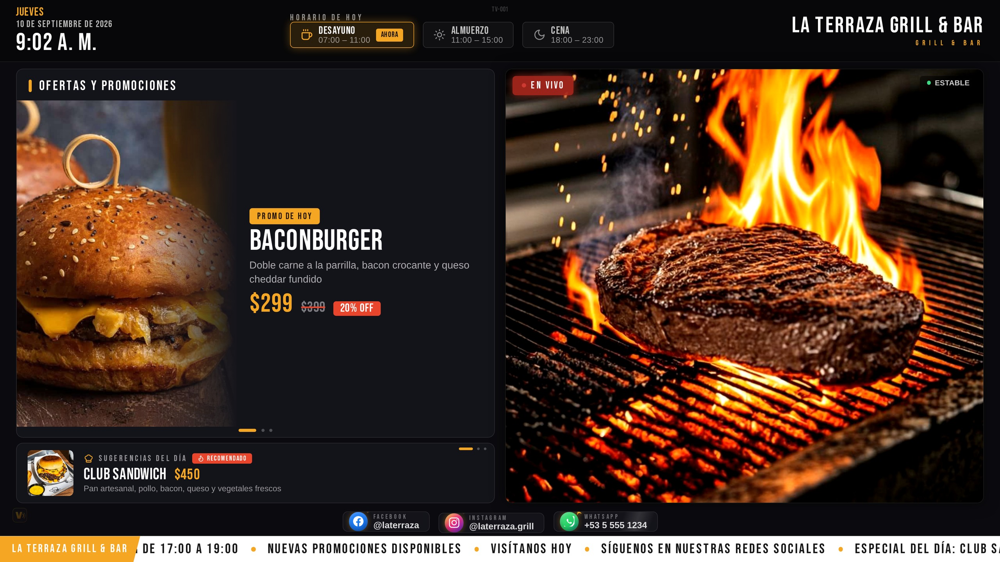
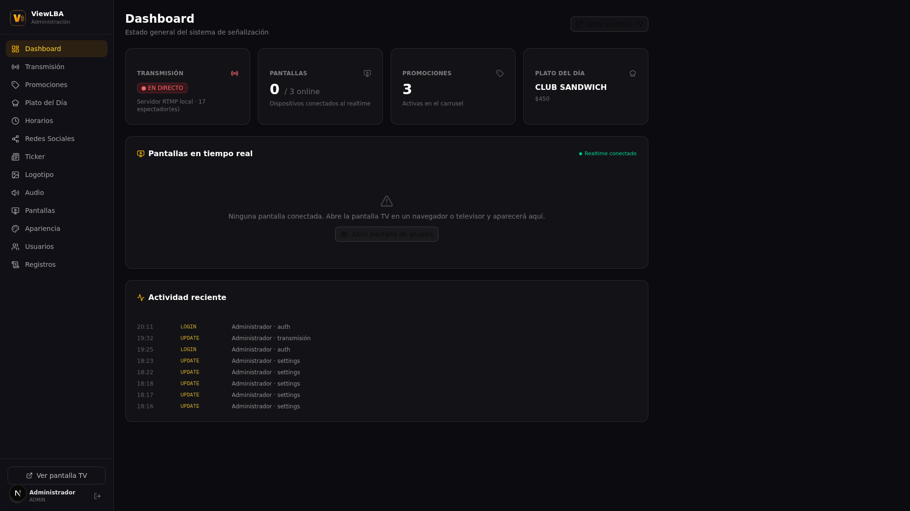
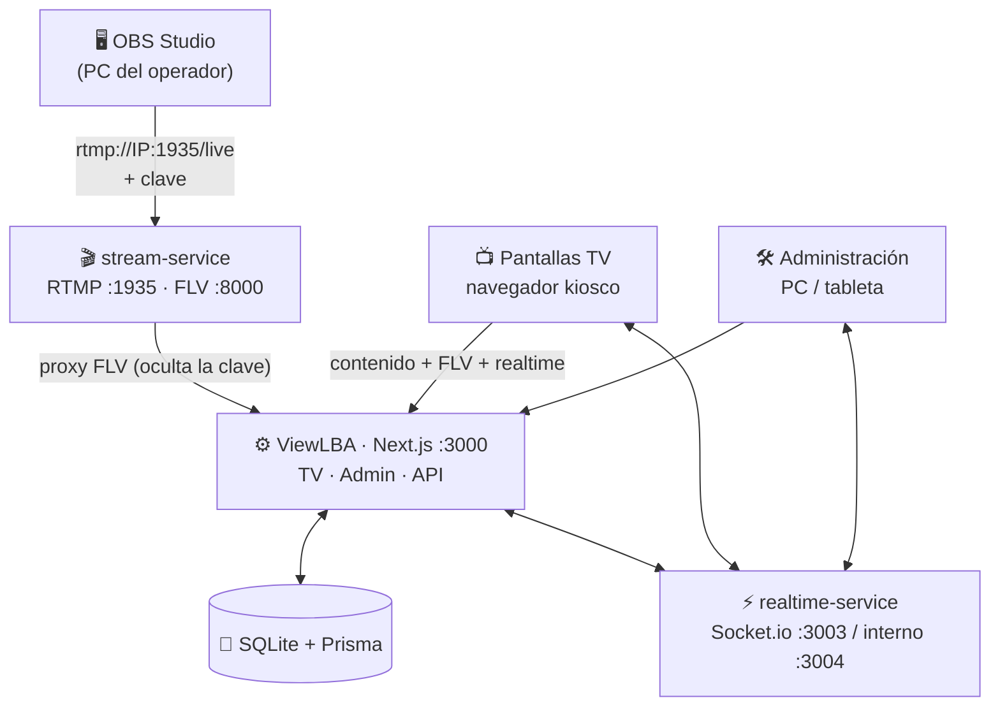

<div align="center">


# ViewLBA

**Plataforma profesional de señalización digital para restaurantes**

Pantalla TV · Panel de administración · Servidor de streaming RTMP integrado · 100 % LAN

[](https://github.com/Lean031110/View_LBA/actions/workflows/ci.yml)
[](https://github.com/Lean031110/View_LBA/actions/workflows/installer-flow.yml)
[](LICENSE)
[](https://bun.sh)
[](https://nextjs.org)
[](#%EF%B8%8F-arquitectura)

</div>

---

## 📸 El sistema en acción

**Pantalla TV con transmisión en vivo.** OBS transmite por RTMP al servidor integrado y el vídeo
aparece en las televisiones del local en segundos. A la izquierda, promociones y sugerencias del
día; abajo, ticker de noticias y redes sociales. Todo el contenido se administra en caliente,
sin recargar la pantalla.

<p align="center">
  
</p>

**Panel de administración — Dashboard.** Estado del sistema en tiempo real: transmisión activa con
espectadores, pantallas conectadas (identidad, resolución, estado), promociones vigentes y
registro de auditoría. Cada TV se registra y aparece aquí al instante.

<p align="center">
  
</p>

**Panel de administración — Transmisión.** La URL RTMP y la clave de transmisión se copian con un
clic y se pegan en OBS Studio. La clave se valida en el servidor, se puede rotar sin reiniciar y
nunca llega al navegador de la TV.

<p align="center">
  
</p>

**Página principal.** Un solo servidor, dos aplicaciones: la pantalla para los televisores y el
panel para el encargado. La página de inicio verifica el backend y da acceso directo a ambas.

<p align="center">
  
</p>

---

## 🖥️ ¿Qué es ViewLBA?

ViewLBA es un sistema completo de señalización digital pensado para el día a día de un
restaurante: **dos aplicaciones web sobre el mismo servidor local** —

| Aplicación | URL | Uso |
|---|---|---|
| 📺 **Pantalla TV** | `http://IP-DEL-SERVIDOR:3000/?view=tv` | Televisores del local (72"+, vertical u horizontal) |
| 🛠️ **Panel de administración** | `http://IP-DEL-SERVIDOR:3000/?view=admin` | PC o tableta del encargado |

— más un **servidor de streaming RTMP integrado** que se administra desde el panel: copias la URL
de ingest, la pegas en **OBS Studio**, y la transmisión aparece en las televisiones de la sala **en
segundos**. Todo por la red local: el sistema funciona **sin depender de Internet para nada**.

### Características

- 🔴 **Transmisión en vivo como protagonista** — OBS → RTMP (puerto 1935) → HTTP-FLV de baja
  latencia → pantalla TV, con indicador *EN VIVO*, métricas (resolución, bitrate, espectadores) y
  reconexión automática (5/10/15 s → modo fallback).
- 🔑 **Servidor de streaming propio** — URL RTMP y clave de transmisión copiables desde el panel;
  la clave se valida en el servidor, se puede rotar sin reiniciar y **nunca llega al navegador de
  la TV** (proxy server-side).
- ⚡ **Tiempo real** — cada cambio hecho en la administración (promoción, ticker, plato, audio,
  colores…) se refleja en las pantallas al instante, sin recargar.
- 🧯 **Estabilidad 24/7** — watchdog de backend y del reproductor, fallback elegante («LA
  TRANSMISIÓN SE REANUDARÁ EN BREVE»), wake lock, modo kiosco, ocultación de cursor y
  supervisores de servicios con reinicio automático.
- 🖼️ **Contenido completo** — promociones a media pantalla con imagen grande, banner rotativo de
  sugerencias del día (auto-slide en bucle), horarios con turno activo destacado, redes sociales
  compactas con destellos (Facebook · Instagram · WhatsApp), ticker izquierda→derecha, logotipo,
  colores y tipografía configurables.
- 📺 **Multiseñalización** — registra cada TV (TV-001 Salón, TV-002 Espera, TV-003 Cocina…) y
  controla su estado, resolución y audio de forma remota.
- 👥 **Roles y auditoría** — ADMIN / OPERADOR / VISOR, registro de acciones y autenticación con
  contraseñas scrypt.
- 🖥️ **Bandeja del sistema permanente** (v3.2.1) — un icono en la barra de tareas indica en todo
  momento si el servidor está activo (VERDE), detenido (ROJO) o en transición (AMARILLO), con
  menú **Iniciar · Detener · Reiniciar · Configurar… · Abrir Panel · Salir**, ventana de
  configuración (estado, credenciales, carpetas, control del servicio), notificaciones al cambiar
  de estado e inicio automático con la sesión. Sin depender de nada del sistema: PowerShell puro
  en Windows, TypeScript puro hablando D-Bus en Linux (ver [Bandeja del sistema](#-bandeja-del-sistema)).
- 💿 **Instaladores 100 % offline** (v3.2.x) — `ViewLBA-Server-Setup.exe` (Windows) y
  `ViewLBA-Server.AppImage` / `.deb` (Linux) llevan DENTRO el runtime Bun, los `node_modules`
  del servidor, los engines de Prisma, NSSM (Windows) y las plantillas systemd (Linux): se
  instalan en una máquina **sin Internet** y el servidor queda arrancado y funcional. La CI lo
  demuestra en cada push bloqueando la red de verdad (iptables REJECT / firewall BLOCK) durante
  la instalación. Ver [Instalación (producción)](#instalación-producción--multiplataforma-sin-editar-archivos).
- 🔐 **Licenciamiento por token copiar/pegar** (v2.0+; release **3.0.0** con APK firmado) —
  prueba de 7 días automática con marca de
  agua, planes **Mensual 30 días / USD 10** y **Anual 365 días / USD 100**, activación sin Internet:
  el cliente copia un código de solicitud, lo manda por WhatsApp y pega el token de licencia que
  recibe. Firma digital Ed25519 por instalación (equipo + disco, ocultos al cliente), funciones
  premium (multi-pantalla, logotipo, usuarios…) desbloqueadas solo con licencia válida.
  Emisión con la app Android privada del administrador. Ver
  [docs/LICENSE-SYSTEM.md](docs/LICENSE-SYSTEM.md) y la [wiki](docs/wiki/).
- 🎨 **Temas de pantalla TV** (v3.1) — gestor de temas en Administración con importación de
  paquetes **`.vtheme`** 100 % declarativos (nunca código), vista previa, aplicación al instante
  (realtime a todas las TVs) y restauración del tema predeterminado. Tres temas oficiales
  integrados — **Default** (siempre disponible, fallback garantizado), **Classic** (elegante
  oscuro/dorado) y **Neon** (tecnológico cian/magenta) — con pipeline de importación de 21
  validaciones de seguridad (path traversal, ZIP bomb, symlinks, MIME falso…). Requiere licencia
  completa; el trial lo visualiza bloqueado. Ver
  [docs/THEMES.md](docs/THEMES.md) y [docs/THEME_SECURITY.md](docs/THEME_SECURITY.md).
- 📘 **Manual de Usuario para clientes** (v3.1) — PDF profesional en español (16 capítulos:
  instalación, prueba de 7 días, activación por WhatsApp, temas con capturas reales, backup,
  problemas frecuentes), generado de forma determinista y **validado en CI** (textos y branding
  obligatorios). Ver [docs/CUSTOMER-MANUAL.md](docs/CUSTOMER-MANUAL.md).

## 🏗️ Arquitectura



| Puerto | Servicio | Acceso recomendado |
|---|---|---|
| **3000** | Aplicación web (TV + admin + API) | Toda la LAN |
| **1935** | RTMP ingest (OBS) | PCs con OBS |
| **8000** | HTTP-FLV interno | Solo localhost (la TV usa el proxy :3000) |
| **3003** | Realtime WebSocket | Toda la LAN |
| **8100** | Control del servidor de streaming | Solo localhost |

> 📘 Guía operativa completa (firewall, arranque, TVs, OBS): [README-LAN.md](README-LAN.md)
>
> 📚 **Documentación completa** en [`docs/`](docs/): [ARQUITECTURA](docs/ARCHITECTURE.md) · [INSTALACIÓN](docs/INSTALLATION.md) · [INSTALADORES](docs/INSTALLER.md) · [INSTALADOR LINUX](docs/INSTALLER-LINUX.md) · [INSTALADOR WINDOWS](docs/INSTALLER-WINDOWS.md) · [RELEASE](docs/RELEASE.md) · [LINUX](docs/LINUX_PRODUCTION.md) · [WINDOWS](docs/WINDOWS_PRODUCTION.md) · [OBS](docs/OBS_SETUP.md) · [TVs](docs/TV_SETUP.md) · [EMPAREJAMIENTO](docs/SCREEN_PAIRING.md) · [BACKUP](docs/BACKUP_RESTORE.md) · [FIREWALL](docs/FIREWALL.md) · [TROUBLESHOOTING](docs/TROUBLESHOOTING.md) · [ACTUALIZAR](docs/UPGRADING.md) · [SEGURIDAD](docs/SECURITY.md) · [OPERACIONES](docs/OPERATIONS.md) · [LICENCIAS](docs/LICENSE-SYSTEM.md) · [EMISOR DE LICENCIAS](docs/LICENSE-GENERATOR.md) · [SEGURIDAD DE LICENCIAS](docs/LICENSE-SECURITY.md)

## 🚀 Puesta en marcha

### Requisitos

- Para instalar desde los **instaladores oficiales**: solo Windows 10/11 o Linux con systemd —
  el runtime y TODAS las dependencias viajan dentro del paquete (ni Bun, ni Node, ni Internet).
- Para montar desde el repositorio: [Bun](https://bun.sh) 1.1+ (recomendado) o Node.js 20.9+
  (LTS), un PC en la LAN del restaurante (el «servidor») y OBS Studio en el PC que transmitirá.
- TVs con navegador moderno (PC/mini-PC conectado, o Smart TV con Chrome/Edge/Firefox).

### Instalación (producción — multiplataforma, sin editar archivos)

**Instaladores oficiales (recomendado — paquete offline completo, sin clonar
GitHub ni instalar dependencias a mano):**

- Windows: `ViewLBA-Setup.exe` (doble clic → asistente GUI → listo). Instala el servidor, el
  runtime Bun, NSSM y el servicio de Windows; al terminar el servicio está **Running** y la
  bandeja del sistema queda activa.
- Linux: `ViewLBA-Server.deb` (GUI con `sudo dpkg -i` o `apt install`, modo `--cli` en headless)
  o el `ViewLBA-Server.AppImage`. Instalan servidor + build + runtime Bun + servicio systemd y
  la bandeja `viewlba-tray`.

Ambos empaquetan el **runtime Bun + `node_modules` + engines de Prisma + plantillas de
servicio** dentro del instalador: funcionan en máquinas **completamente offline**, y la CI lo
verifica en cada push instalando con la red bloqueada (Linux: `iptables` REJECT salvo loopback;
Windows: reglas de firewall outbound BLOCK) y comprobando instalación + `/api/health` sin red
externa. Ver `docs/INSTALLER.md` (arquitectura y flujo), `docs/INSTALLER-LINUX.md`,
`docs/INSTALLER-WINDOWS.md` y `docs/RELEASE.md` (artefactos y checksums).

**Desde el repositorio (desarrollo/avanzado):**

```bash
git clone https://github.com/Lean031110/View_LBA.git
cd View_LBA

bun scripts/install.ts          # delega en installer/cli (misma lógica oficial)
# preflight → dependencias → .env con secretos aleatorios → migraciones
# (prisma migrate deploy) → primer admin → build standalone → health
```

Despliegue 24/7: Linux systemd (`deploy/linux/install.sh` ·
`viewlba-installer services …`) · Windows NSSM (`deploy\windows\install.ps1`)
— guías en `docs/LINUX_PRODUCTION.md` y `docs/WINDOWS_PRODUCTION.md`.

### Desarrollo

```bash
bun install
bun run setup               # Prisma Client + migraciones + datos demo
bun run dev                 # → http://localhost:3000
```

Credenciales demo (solo desarrollo; cámbialas en **Usuarios** tras entrar):

| Usuario | Correo | Contraseña | Rol |
|---|---|---|---|
| Administrador | `admin@restaurante.com` | `admin123` | ADMIN |
| Operador | `operador@restaurante.com` | `operador123` | OPERATOR |

> ⚠ **Solo desarrollo**: los usuarios demo se crean con
> `bun prisma/seed.ts --with-demo-users` (nunca en producción). Para producción usa
> `bun scripts/init-production.ts` y define tu propia contraseña (mínimo 10 caracteres,
> mayúscula/minúscula/número).

### Servicios (producción en LAN)

```bash
# Realtime + servidor de streaming con auto-reinicio
bash scripts/realtime-supervisor.sh &
bash scripts/stream-supervisor.sh &

# Aplicación (build standalone)
bun run build && bun run start
```

## 🖥️ Bandeja del sistema

Los instaladores dejan un **indicador permanente en la barra de tareas** que muestra el estado
real del servidor y permite controlarlo sin abrir el panel:

| | Windows | Linux |
|---|---|---|
| **Icono** | VERDE activo · ROJO detenido · AMARILLO en transición | Igual (tema hicolor 22/32/48 px) |
| **Menú** | Iniciar · Detener · Reiniciar · Configurar… · Abrir Panel · Salir | Igual (DBusMenu) |
| **Configurar** | Ventana con estado en vivo, credenciales, carpetas y control del servicio | Estado, credenciales y logs por CLI (`viewlba-server configure`) |
| **Notificaciones** | Globos al cambiar de estado | Notificaciones freedesktop |
| **Autostart** | Clave `Run` de HKCU con la sesión | XDG autostart + `.desktop` |
| **Instancia única** | pid-file (segunda copia sale sola) | pid-file (segunda copia sale sola) |

**Cero dependencias del sistema.** La bandeja de Windows es PowerShell (integrado en el
sistema). La de Linux está escrita en TypeScript puro que habla D-Bus directamente
(StatusNotifierItem + DBusMenu + notificaciones) y se ejecuta con el **mismo runtime Bun que ya
viaja dentro del .deb** — no requiere Python, GTK ni AppIndicator, y funciona igual en KDE,
XFCE, MATE, Cinnamon y GNOME (Ubuntu). En modo headless se degrada con un mensaje claro y
`exit 0`. El comando `viewlba-tray --check` permite a la CI validarla sin escritorio.

## 🎥 Transmitir con OBS (5 pasos)

1. Entra en la **administración → Transmisión**.
2. Copia la **URL RTMP** (`rtmp://IP-DEL-SERVIDOR:1935/live`) con el botón **Copiar**.
3. En OBS: *Configuración → Emisión → Servicio: Personalizado* → pega la URL.
4. Copia la **clave de transmisión** (mostrar 🔍) y pégala en OBS → **Iniciar transmisión**.
5. El panel pasará a **EN VIVO** y todas las TVs mostrarán el video al instante. 🎉

Si detienes OBS, las pantallas pasan solas al fallback y vuelven al vivo automáticamente al
reconectar — sin tocar nada.

## 📺 Configurar una TV

1. Abre `http://IP-DEL-SERVIDOR:3000/?view=tv` en el navegador del TV.
2. Elige su identidad (TV-001, TV-002…; tecla **S** para cambiarla después).
3. Pulsa el botón ⛶ **Pantalla completa** — la marca ViewLBA se oculta automáticamente para
   dejar solo el contenido del restaurante.
4. Déjala abierta: wake lock y watchdog la mantienen viva 24/7.

## 🗂️ Estructura del proyecto

```
├── src/
│   ├── app/                    # Página única (?view=tv|admin) + API routes
│   │   └── api/                #   auth · content · stream (status/FLV) · upload · admin CRUD
│   ├── components/
│   │   ├── display/            # TV: StreamPlayer, Clock, Ticker, Promos…
│   │   └── admin/              # Panel: Login + 15 secciones
│   └── lib/                    # auth · crud · fields · net · brand · realtime · themes
├── mini-services/
│   ├── stream-service/         # Servidor RTMP integrado (node-media-server)
│   └── realtime-service/       # Hub Socket.io (estado, heartbeats, comandos)
├── installer/                  # CLI de instalación + empaquetado nativo (.deb / NSIS)
│   ├── core/                   #   preflight · fases · rollback · health
│   ├── linux/                  #   build-deb + bandeja TypeScript/D-Bus (tray/)
│   ├── windows/                #   NSIS + bandeja PowerShell
│   └── package/                #   payload: runtime Bun + node_modules + engines
├── android-license-generator/  # App privada del admin (emisión de licencias, APK firmado)
├── prisma/                     # schema.prisma + seed
├── tests/                      # 47 suites: unit + installer + themes + licencias
├── e2e/                        # E2E Playwright (9 specs · 52 tests)
├── scripts/                    # install · init-production · backup/restore · build/start ·
│                               # supervisores · capturas · gates (check-version, check-docs)
├── deploy/                     # linux (systemd) · windows (NSSM)
├── themes/                     # Temas oficiales .vtheme (Default · Classic · Neon)
└── docs/                       # Guías de producción + screenshots + wiki
```

## 🧪 Calidad

```bash
bun run lint        # ESLint — 0 errores · 0 warnings
bun run typecheck   # TypeScript estricto (src/)
bun run typecheck:installer  # TypeScript estricto del instalador y la bandeja (installer/ + scripts/)
bun test            # 776 tests: unit + realtime + pairing + recovery + installer (CLI,
                    # adaptadores, bandeja D-Bus con dbus-daemon real) + pipeline de
                    # streaming con ffmpeg publicando por RTMP + temas (parser ZIP/
                    # validator/importer 21 pasos/store/backup con DB real) + gating HTTP
                    # de trial + licencias
bun run docs:check  # Coherencia de documentación: enlaces del README, badges del repo,
                    # screenshots, índice de docs y conteos E2E
bun run build       # Build de producción (standalone)
bun run test:e2e    # E2E Playwright (52 tests / 22 escenarios: auth, contenido,
                    # pantallas, pairing, streaming con ffmpeg real, offline,
                    # seguridad, temas §22: importar/aplicar/persistir/eliminar/realtime)
```

CI en GitHub Actions — **todo lo anterior en cada push/PR a `main`**:

| Workflow | Qué verifica |
|---|---|
| **CI** (`ci.yml`) | **quality**: lint, tipos (`src/` + instalador), gate de versión (`/VERSION` única fuente de verdad), gate de documentación (`check-docs.ts`), 776 tests y build standalone · **integration**: API contra servidor real + licencias (VLREQ2, activación, trial, gating) · **e2e**: Playwright · **security**: `gitleaks` en toda la historia + `bun audit` crítico bloqueante |
| **Installer Flow CI** (`installer-flow.yml`) | Flujo completo por SO en runners reales: instalar → bandeja (viva, icono, menú) → iniciar/detener → configurar → **instalación 100 % offline con la red BLOQUEADA** (iptables/firewall) → desinstalar |
| **Android License Generator** | Lint, tests JVM, fuzz, escaneo anti-claves y **APK firmado y verificado** (apksigner v1+v2+v3, zipalign, badging, análisis del binario) |
| **Customer Manual** | PDF del manual del cliente regenerado y validado (textos y branding obligatorios) |
| **Android Emulator Smoke** | Instalación real del APK en emulador: primera pantalla con PIN, HOME, persistencia del vault, desbloqueo y flujo completo de emisión de licencia |
| **Release Installers** (tags `v*`) | Empaqueta y publica los instaladores oficiales + checksums, instalando el `.deb` y el `Setup.exe` en runners reales antes de publicar |

## 🔒 Seguridad

- Clave RTMP enmascarada; revelable/regenerable solo por ADMIN; validada server-side (hook
  `prePublish`); **nunca llega al navegador de la TV**.
- **Sistema de licencias v2 con criptografía asimétrica** — las claves PRIVADAS de firma/apertura
  viven SOLO en la app Android del administrador (DB cifrada SQLCipher + PIN/biometría); el
  servidor solo contiene las claves PÚBLICAS. Historial escaneado con gitleaks en cada push
  y análisis anti-claves del artifact APK.
- Sesiones httpOnly firmadas (HMAC) · contraseñas scrypt · 3 roles con matriz de permisos.
- Subida de archivos validada por *magic bytes* (no por MIME), nombres generados por el servidor
  y cuota de almacenamiento.
- Secretos solo en `.env` (gitignored) — ver [SECURITY.md](SECURITY.md).

## 📄 Licencia

Distribuido bajo la licencia [MIT](LICENSE) · © 2026 Lean031110

---

<div align="center">

**ViewLBA** · hecho con ❤️ para restaurantes

</div>
