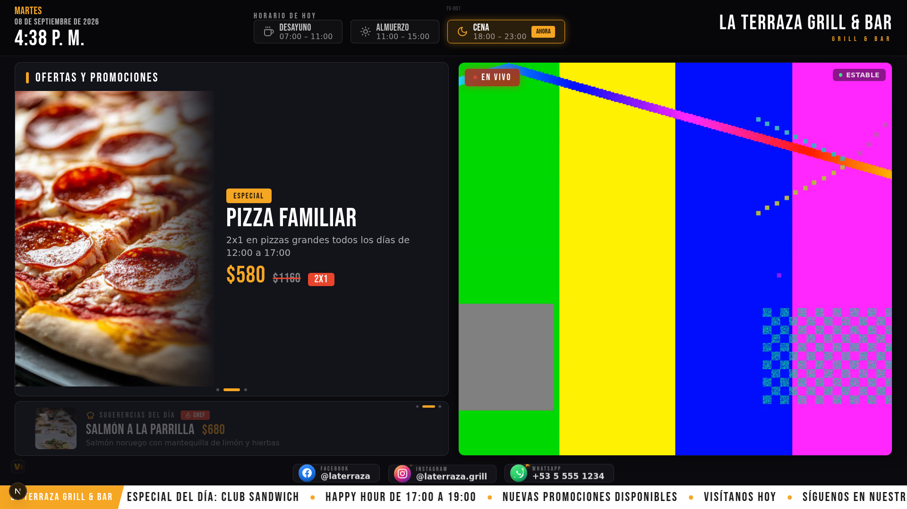
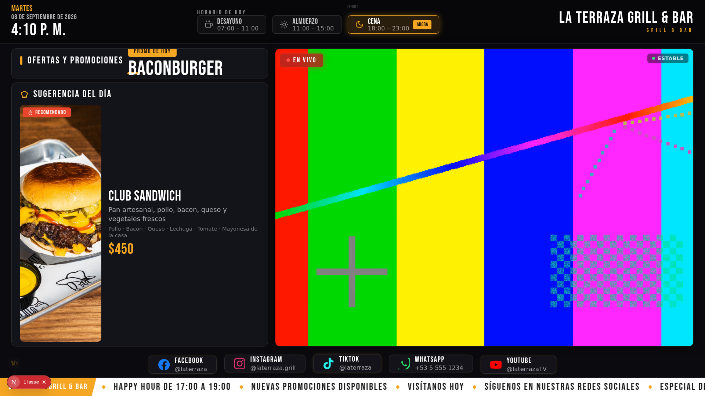
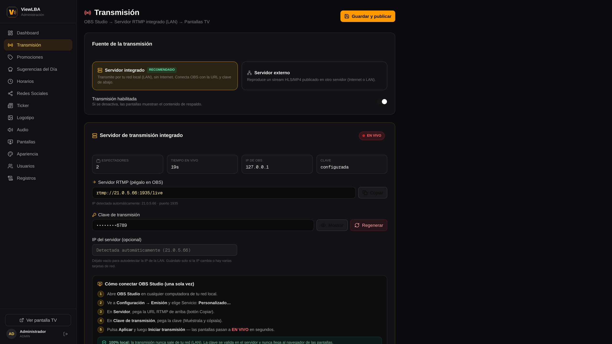
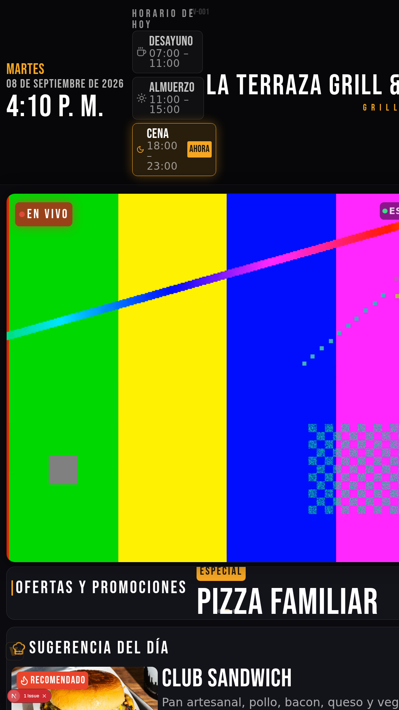
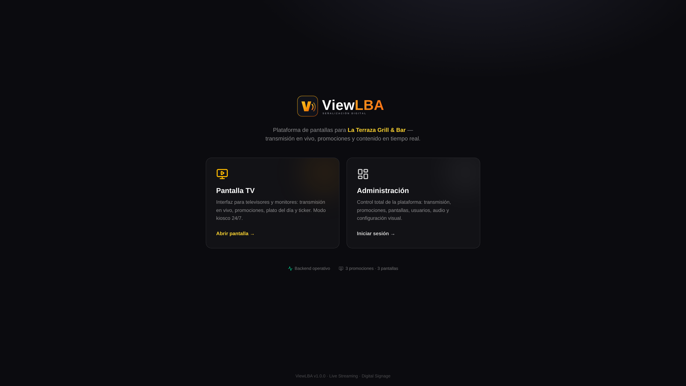
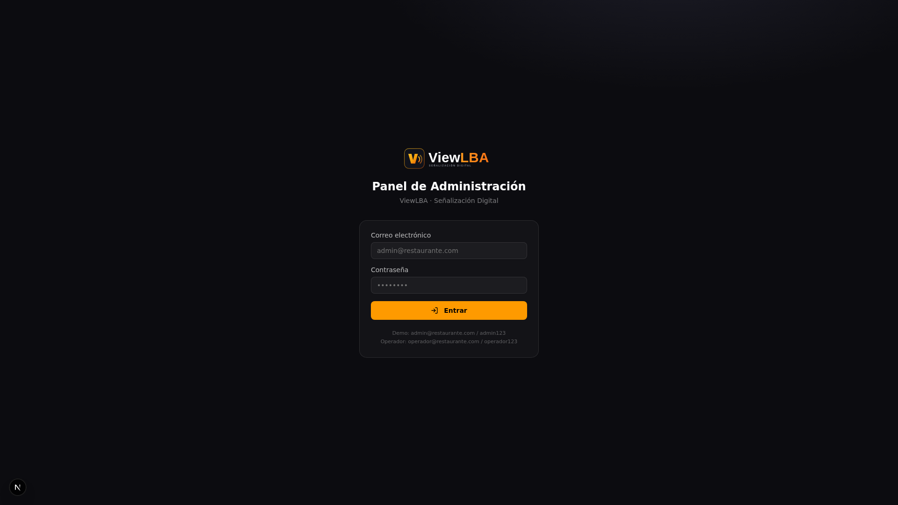
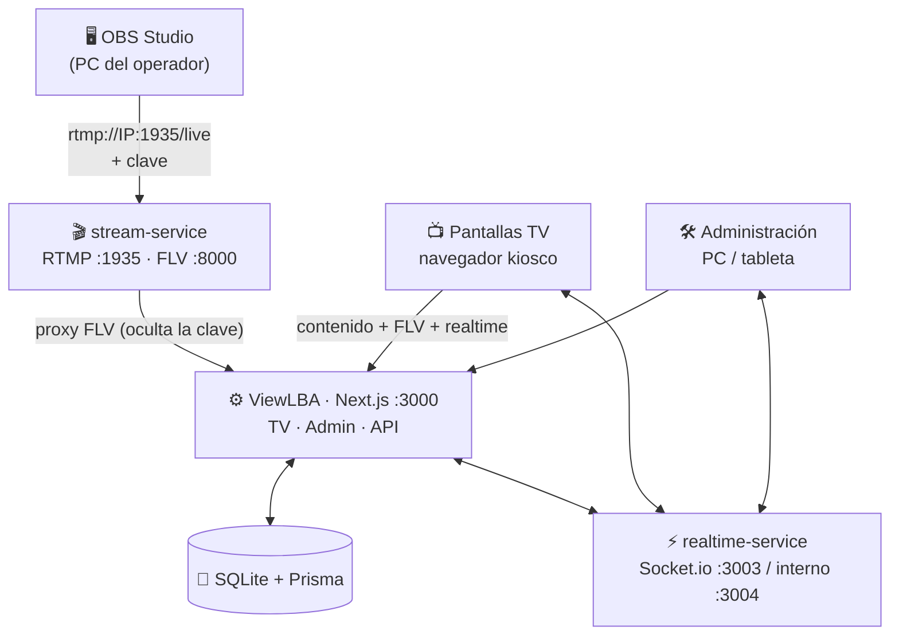

<div align="center">


# ViewLBA

**Plataforma profesional de señalización digital para restaurantes**
Pantalla TV · Panel de administración · Servidor de streaming RTMP integrado · 100 % LAN

[](https://github.com/Lean031110/Pantalla_Restaurante/actions/workflows/ci.yml)
[](LICENSE)
[](https://bun.sh)
[](https://nextjs.org)
[](#-arquitectura)

</div>

---

## 🖥️ ¿Qué es ViewLBA?

ViewLBA es un sistema completo de señalización digital pensado para el día a día
de un restaurante: **dos aplicaciones web sobre el mismo servidor local** —

| Aplicación | URL | Uso |
|---|---|---|
| 📺 **Pantalla TV** | `http://IP-DEL-SERVIDOR:3000/?view=tv` | Televisores del local (72"+, vertical u horizontal) |
| 🛠️ **Panel de administración** | `http://IP-DEL-SERVIDOR:3000/?view=admin` | PC o tableta del encargado |

— más un **servidor de streaming RTMP integrado** que se administra desde el
panel: copias la URL de ingest, la pegas en **OBS Studio**, y la transmisión
aparece en las televisiones de la sala **en segundos**. Todo por la red local:
el sistema funciona **sin depender de Internet para nada**.

### Características

- 🔴 **Transmisión en vivo como protagonista** — OBS → RTMP (puerto 1935) →
  HTTP-FLV de baja latencia → pantalla TV, con indicador *EN VIVO*,
  métricas (resolución, bitrate, espectadores) y reconexión automática
  (5/10/15 s → modo fallback).
- 🔑 **Servidor de streaming propio** — URL RTMP y clave de transmisión
  copiables desde el panel; la clave se valida en el servidor, se puede rotar
  sin reiniciar y **nunca llega al navegador de la TV** (proxy server-side).
- ⚡ **Tiempo real** — cada cambio hecho en la administración (promoción,
  ticker, plato, audio, colores…) se refleja en las pantallas al instante,
  sin recargar.
- 🧯 **Estabilidad 24/7** — watchdog de backend y del reproductor, fallback
  elegante («LA TRANSMISIÓN SE REANUDARÁ EN BREVE»), wake lock, modo kiosco,
  ocultación de cursor y supervisores de servicios con reinicio automático.
- 🖼️ **Contenido completo** — promociones a media pantalla con imagen grande,
  banner rotativo de sugerencias del día (auto-slide en bucle), horarios con
  turno activo destacado, redes sociales compactas con destellos (Facebook ·
  Instagram · WhatsApp), ticker izquierda→derecha, logotipo, colores y
  tipografía configurables.
- 📺 **Multiseñalización** — registra cada TV (TV-001 Salón, TV-002 Espera,
  TV-003 Cocina…) y controla su estado, resolución y audio de forma remota.
- 👥 **Roles y auditoría** — ADMIN / OPERADOR / VISOR, registro de acciones
  y autenticación con contraseñas scrypt.

## 📸 Capturas

| Pantalla TV v1.1 (EN VIVO) | Pantalla TV (EN VIVO) | Panel · Transmisión |
|:---:|:---:|:---:|
|  |  |  |

| TV vertical | Acceso | Inicio de sesión |
|:---:|:---:|:---:|
|  |  |  |

## 🏗️ Arquitectura



| Puerto | Servicio | Acceso recomendado |
|---|---|---|
| **3000** | Aplicación web (TV + admin + API) | Toda la LAN |
| **1935** | RTMP ingest (OBS) | PCs con OBS |
| **8000** | HTTP-FLV interno | Solo localhost (la TV usa el proxy :3000) |
| **3003** | Realtime WebSocket | Toda la LAN |
| **8100** | Control del servidor de streaming | Solo localhost |

> 📘 Guía operativa completa (firewall, arranque, TVs, OBS): [README-LAN.md](README-LAN.md)

## 🚀 Puesta en marcha

### Requisitos

- [Bun](https://bun.sh) 1.1+ (recomendado) o Node.js 20.9+ (LTS)
- Un PC en la LAN del restaurante (el «servidor»)
- OBS Studio en el PC que transmitirá
- TVs con navegador moderno (PC/mini-PC conectado, o Smart TV con Chrome/Edge/Firefox)

### Instalación

```bash
git clone https://github.com/Lean031110/Pantalla_Restaurante.git
cd Pantalla_Restaurante

bun install
cp .env.example .env        # ⚠️ edita AUTH_SECRET y REALTIME_TOKEN
bun run setup               # Prisma Client + base de datos + datos demo
bun run dev                 # → http://localhost:3000
```

Credenciales demo (cámbialas en **Usuarios** tras entrar):

| Usuario | Correo | Contraseña | Rol |
|---|---|---|---|
| Administrador | `admin@restaurante.com` | `admin123` | ADMIN |

> ⚠ **Solo desarrollo**: los usuarios demo se crean con
> `bun prisma/seed.ts --with-demo-users` (nunca en producción). Para
> producción usa `bun scripts/init-production.ts` y define tu propia
> contraseña (mínimo 10 caracteres, mayúscula/minúscula/número).

### Servicios (producción en LAN)

```bash
# Realtime + servidor de streaming con auto-reinicio
bash scripts/realtime-supervisor.sh &
bash scripts/stream-supervisor.sh &

# Aplicación (build standalone)
bun run build && bun run start
```

## 🎥 Transmitir con OBS (5 pasos)

1. Entra en la **administración → Transmisión**.
2. Copia la **URL RTMP** (`rtmp://IP-DEL-SERVIDOR:1935/live`) con el botón **Copiar**.
3. En OBS: *Configuración → Emisión → Servicio: Personalizado* → pega la URL.
4. Copia la **clave de transmisión** (mostrar 🔍) y pégala en OBS → **Iniciar transmisión**.
5. El panel pasará a **EN VIVO** y todas las TVs mostrarán el video al instante. 🎉

Si detienes OBS, las pantallas pasan solas al fallback y vuelven al vivo
automáticamente al reconectar — sin tocar nada.

## 📺 Configurar una TV

1. Abre `http://IP-DEL-SERVIDOR:3000/?view=tv` en el navegador del TV.
2. Elige su identidad (TV-001, TV-002…; tecla **S** para cambiarla después).
3. Pulsa el botón ⛶ **Pantalla completa** — la marca ViewLBA se oculta
   automáticamente para dejar solo el contenido del restaurante.
4. Déjala abierta: wake lock y watchdog la mantienen viva 24/7.

## 🗂️ Estructura del proyecto

```
├── src/
│   ├── app/                    # Página única (?view=tv|admin) + API routes
│   │   └── api/                #   auth · content · stream (status/FLV) · admin CRUD
│   ├── components/
│   │   ├── display/            # TV: StreamPlayer, Clock, Ticker, Promos…
│   │   └── admin/              # Panel: Login + 13 secciones
│   └── lib/                    # auth · crud · fields · net · brand · realtime
├── mini-services/
│   ├── stream-service/         # Servidor RTMP integrado (node-media-server)
│   └── realtime-service/       # Hub Socket.io (estado, heartbeats, comandos)
├── prisma/                     # schema.prisma + seed
├── tests/                      # Tests unitarios (bun test)
├── scripts/                    # Supervisores + seed de streaming local
└── docs/screenshots/           # Capturas del sistema
```

## 🧪 Calidad

```bash
bun run lint        # ESLint — 0 errores · 0 warnings
bun run typecheck   # TypeScript estricto
bun test            # Tests unitarios
bun run build       # Build de producción (standalone)
```

CI en GitHub Actions ejecuta la misma secuencia en cada push/PR.

## 🔒 Seguridad

- Clave RTMP enmascarada; revelable/regenerable solo por ADMIN; validada
  server-side (hook `prePublish`); **nunca llega al navegador de la TV**.
- Sesiones httpOnly firmadas (HMAC) · contraseñas scrypt · 3 roles.
- Secretos solo en `.env` (gitignored) — ver [SECURITY.md](SECURITY.md).

## 📄 Licencia

Distribuido bajo la licencia [MIT](LICENSE) · © 2026 Lean031110

---

<div align="center">

**ViewLBA** · hecho con ❤️ para restaurantes

</div>
